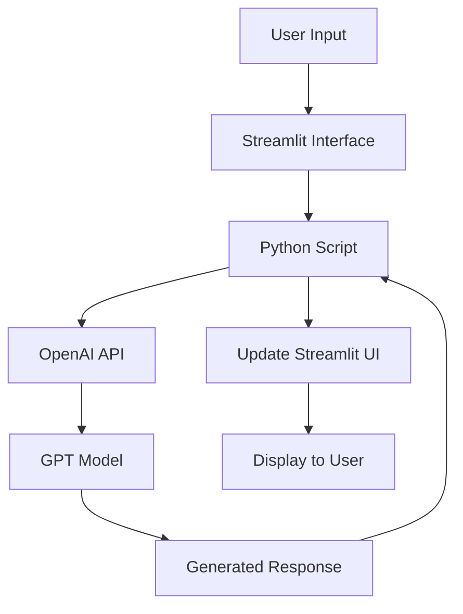

# Simple OpenAI Chatbot with Streamlit

This project implements a basic chatbot using OpenAI's GPT model and Streamlit. The chatbot can engage in conversations on various topics and provide responses based on the input it receives, all within a user-friendly web interface.

## Features

- Natural language conversation
- Integration with OpenAI's GPT model
- Streamlit-based web interface
- Conversation history display
- Ability to clear chat history

## Requirements

- Python 3.7+
- OpenAI API key
- Streamlit

## Installation

1. Clone this repository
2. Install required packages: `pip install -r requirements.txt`
3. Set up your OpenAI API key as an environment variable

## Usage

Run the Streamlit app:

```
streamlit run simple_chatbot.py
```

Enter your messages in the text input field and press Enter or click the "Send" button. The chatbot will respond, and the conversation will be displayed in the chat area.

## Architecture



1. User provides input through the Streamlit interface
2. Streamlit passes the input to the Python script
3. Python script processes the input and sends it to OpenAI API
4. GPT model generates a response
5. Response is returned to the Python script
6. Script updates the Streamlit UI with the new message
7. Updated conversation is displayed to the user

## Contributing

Contributions are welcome! Please feel free to submit a Pull Request.

## License

This project is open source and available under the [MIT License](LICENSE).
