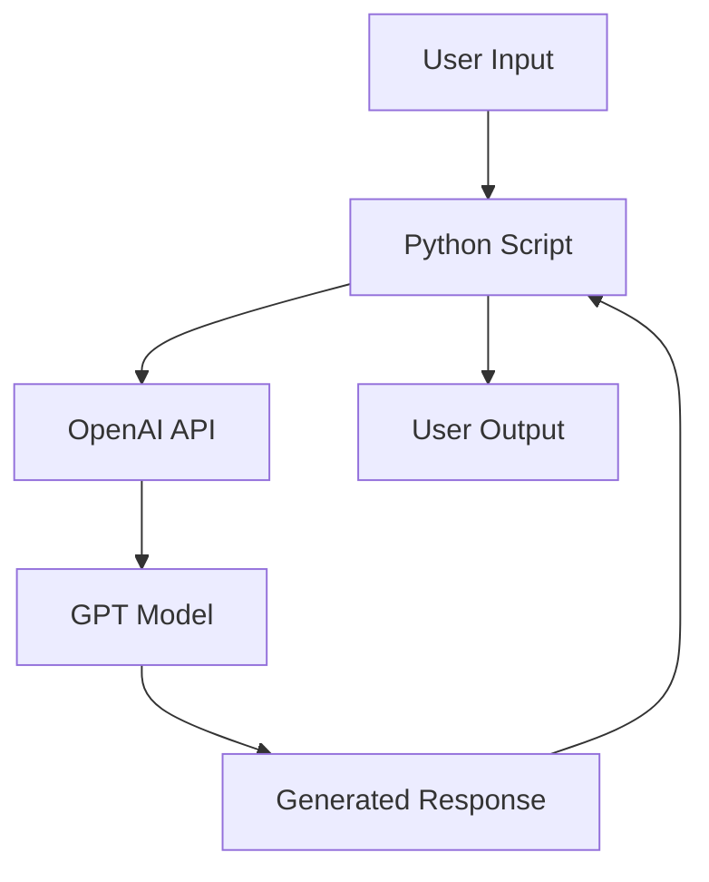

# Simple OpenAI Chatbot

This project implements a basic chatbot using OpenAI's GPT model. The chatbot can engage in conversations on various topics and provide responses based on the input it receives.

## Features

- Natural language conversation
- Integration with OpenAI's GPT model
- Easy-to-use interface

## Requirements

- Python 3.7+
- OpenAI API key

## Installation

1. Clone this repository
2. Install required packages: `pip install -r requirements.txt`
3. Set up your OpenAI API key as an environment variable

## Usage

Run the main script:

```
python chatbot.py
```

Enter your messages when prompted, and the chatbot will respond.

## Architecture



1. User provides input through the console
2. Python script processes the input
3. Input is sent to OpenAI API
4. GPT model generates a response
5. Response is returned to the Python script
6. Script displays the response to the user

## Contributing

Contributions are welcome! Please feel free to submit a Pull Request.

## License

This project is open source and available under the [MIT License](LICENSE).
